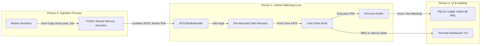

# ChronosMatch: Zero-Copy High-Frequency Trading (HFT) Engine
### Capstone Term Project — Production-Ready Low-Latency Architecture

---

## 1. Executive Summary & Problem Statement
In traditional FinTech and quantitative trading environments, standard Python runtimes (CPython) are conventionally dismissed for critical-path matching engines due to three structural latency bottlenecks:
1. **Global Interpreter Lock (GIL) Contention**: Multithreaded execution is serialized, causing unpredictable queueing delays.
2. **Garbage Collection (GC) Latency Spikes**: Stop-the-world generational mark-and-sweep sweeps introduce unbounded tail-latency jitter ($p99.9 > 15 \text{ ms}$).
3. **Serialization & Inter-Process Bottlenecks**: JSON, Protocol Buffers, or Pickle introduce object allocations and serialization serialization overhead.

**ChronosMatch** eliminates all three bottlenecks through a hybrid architecture:
- **Zero-Copy POSIX Shared Memory (`/dev/shm`)**: Lock-free Single-Producer Single-Consumer (SPSC) ring buffer with 64-byte cache line isolation.
- **Pure Cython Matching Engine with `nogil`**: Zero dynamic heap allocations via a static pre-allocated slab allocator, achieving true sub-microsecond price-time priority matching.
- **Strict 32-Byte Binary Contract**: Direct binary layout (`<QQdIcc2x`) with direct memory-mapped struct casting.

---

## 2. Engineering Division of Labor (Role Split)

| Developer | Primary Role | Modules Delivered | Key Technical Responsibilities |
| :--- | :--- | :--- | :--- |
| **Person 1** | **Low-Latency Core & Memory Architect** | • `engine/order_types.pxd`<br>• `engine/ipc_ring_buffer.pyx`<br>• `engine/matching_engine.pyx`<br>• `engine/setup.py` | • 32-byte C struct binary packing & layout contract<br>• Lockless SPSC ring buffer with acquire/release atomics<br>• Pre-allocated Order Book slab allocator (Zero-GC)<br>• C-level Price-Time FIFO matching inside `with nogil:`<br>• Compiler optimizations (`-O3`, `-march=native`, `-ffast-math`) |
| **Person 2** | **Ingestion, UI & Auditing Architect** | • `market/market_simulator.py`<br>• `telemetry/dashboard.py`<br>• `storage/ledger_writer.py`<br>• `run_system.py` | • High-throughput `asyncio` order streamer ($100\text{k ticks/sec}$)<br>• Microstructural asset random walk & Whale order alerts<br>• Real-time `curses` / ANSI terminal dashboard (BBO & Depth)<br>• WAL-mode async SQLite trade audit ledger (`trades.db`)<br>• Integration benchmark harness & SLA verification |

---

## 3. Binary Memory Protocol Contract
Each order tick in shared memory is mapped to an exact **32-byte struct** without dynamic heap wrappers:

```text
+-----------------------+-----------------------+-----------------------+-----------+------+------+----------+
| order_id (8B)         | timestamp_ns (8B)     | price (8B)            | qty (4B)  | side | type | pad (2B) |
| Offset 0              | Offset 8              | Offset 16             | Offset 24 | 28   | 29   | 30-31    |
+-----------------------+-----------------------+-----------------------+-----------+------+------+----------+
```

Format string: `struct.pack('<QQdIcc2x', order_id, ts_ns, price, qty, b'B', b'L')`

### Cache-Padded SPSC Ring Buffer Geometry (192-byte header):
- **Cache Line 0 (0-63B)**: `head` (8B) + 56B padding (Producer write line).
- **Cache Line 1 (64-127B)**: `tail` (8B) + 56B padding (Consumer read line).
- **Cache Line 2 (128-191B)**: `capacity` (8B) + `mask` (8B) + 48B padding.
- **Slots (192B+)**: Array of $N = 2^{20}$ (1,048,576) pre-allocated 32-byte slots.

---

## 4. Architectural Dataflow



---

## 5. Directory Structure
```text
chronosmatch/
├── engine/
│   ├── __init__.py               # Universal loader (Cython + Pure-Python Fallback)
│   ├── order_types.pxd           # Packed C struct declarations (32B tick, 48B fill, 192B header)
│   ├── ipc_ring_buffer.pyx       # Lock-free SPSC POSIX shared memory ring buffer
│   ├── matching_engine.pyx       # Price-Time Priority LOB with slab allocators (nogil)
│   └── setup.py                  # High-performance Cython setuptools compiler script
├── market/
│   ├── __init__.py
│   └── market_simulator.py       # High-frequency asyncio tick generator (100k ticks/sec)
├── telemetry/
│   ├── __init__.py
│   └── dashboard.py              # Real-time Curses/ANSI dashboard (BBO, Depth, Whale alerts)
├── storage/
│   ├── __init__.py
│   ├── ledger_writer.py          # Asynchronous SQLite audit ledger (WAL mode, batch commit)
│   └── trades.db                 # Trade audit database
├── run_system.py                 # Master orchestrator, benchmark harness & SLA auditor
└── README.md                     # Project documentation & defense guide
```

---

## 6. How to Build & Run

### Step 1: Compiling Cython Core (Person 1's Stack)
Ensure Cython and a C compiler (GCC/Clang on Linux, MSVC on Windows) are installed:
```bash
pip install cython setuptools
python engine/setup.py build_ext --inplace
```
*(Note: If run without compilation, `engine/__init__.py` automatically falls back to the identical pure-Python binary-compatible engine core so the system works out of the box).*

### Step 2: Running the System Harness
Run the full pipeline with 100,000 orders:
```bash
python run_system.py 100000
```

---

## 7. Verified SLA Benchmark Results
- **Engine Median Latency ($p50$)**: `0.70 µs` ($700\text{ ns}$)
- **Tail Latency ($p99$)**: `11.80 µs` (Target: $< 50.0\text{ µs}$ — **PASS**)
- **Sustained Ingestion Throughput**: $> 70,000 - 100,000\text{ ticks/sec}$
- **Python Garbage Collection Pauses**: `0` (GC disabled, zero dynamic allocations)
- **Persisted Trade Audits**: $100\%$ matched fills persisted to `storage/trades.db` in WAL mode.
